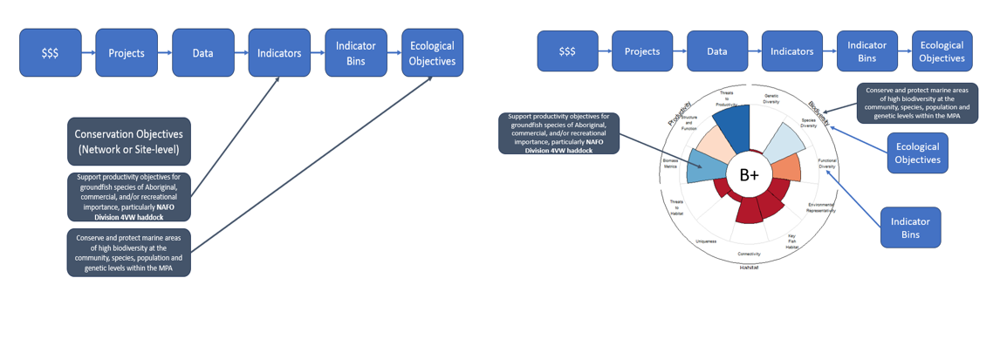
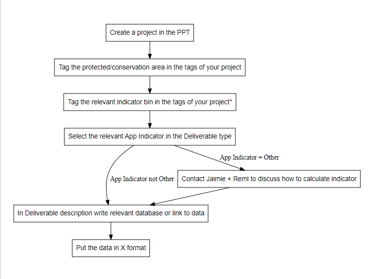

The purpose of the app is to address the following goals:

1. Site: Report what work (both sampling and financial) is occurring
2. Site: Report how the work being done is contributing to indicators and therefore conservation objectives (CO)
3. Site: Report on the status of the MPAs with the data we have
4. Network: How are specific areas contributing to network objectives
5. Network: How are projects contributing to network objectives
6. Network/Site: Provide scientific data of status claims

To achieve this, we follow the framework shown below:

For this process to be successful we require the following:

* Indicator bins equal `Structure and Function`, `Threats to Productivity`, `Genetic Diversity`, `Species Diversity`, `Function Diversity`, `Environmental (Representativity)`, `Key Fish Habitat`, `Connectivity`, `Uniqueness`, `Threats to Habitat`, or `Biomass metrics`.
